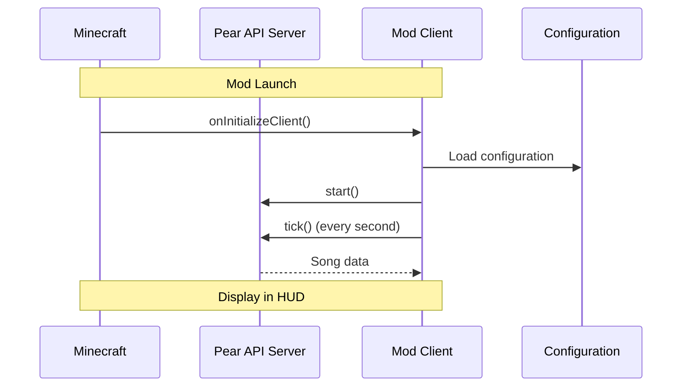

# Pear HUD ⭐

Displays the current music track from **Pear Desktop** in Minecraft's HUD. An elegant small red interface with album art, song title, artist, playback time, and progress bar.


---

## 📦 Mod Information

| Property       | Value                               |
|----------------|--------------------------------------|
| **Mod ID**     | `pearhud`                            |
| **Version**    | 1.0.0 (Minecraft 26.3)              |
| **Authors**    | JusteKal                             |
| **License**    | [MIT](LICENSE)                        |
| **Launch**     | Java 25+ with Fabric API             |

---

## 🎯 Features

- ✅ Display current song title, artist and playback time
- ✅ Visual progress bar
- ✅ Dynamic album art (cover)
- ✅ Connection status indicator (connect, song, pause, offline)
- ✅ Fully configurable via `.minecraft/config/pearhud.json`

---

## 🚀 Installation

### 1️⃣ Prerequisites

- **Minecraft 26.3** or compatible version
- **Fabric Loader >= 0.19.5**
- **Java 25+** required for compilation

### 2️⃣ Install Pear Desktop (API Server)

This mod requires Pear Desktop ! Make sure to have:

1. Installed [Pear Desktop](https://pear-desktop.org/) (v3.12.0+)
2. Enabled the **API Server** plugin in Pear Desktop 
   - Settings > Plugins > API Server > ✅ Enable  
   - Default port: `26538` (HTTP)

### 3️⃣ Authorize Access

1. Launch Minecraft with Pear Desktop
2. A Pear popup will ask you to authorize *"minecraft-pear-hud"*
3. Click **Authorize** → the authentication token will be stored automatically

---

## 🛠️ Build & Compilation

### Compile the mod

```bash
./gradlew build
```

> ⚠️ Requires JDK 25 or above

The jar file will be generated in: `build/libs/

### Copy the mod into Minecraft

1. Place the generated jar in your `mods/` folder (`.minecraft/mods/`)
2. Ensure you launch Minecraft with the correct Fabric API version

---

## ⚙️ Configuration

The configuration file is located at `.minecraft/config/pearhud.json`. Here are the available options:

```json
{
  "enabled": true,                    // Enable/Disable the mod
  "host": "127.0.0.1",               // Pear Desktop Server
  "port": 26538,                     // API Server Port (HTTP)
  "authId": "minecraft-pear-hud",    // Authentication ID
  "accessToken": "",                  // Token (filled automatically on first launch)
  "x": 6,                            // HUD X position (pixels from left)
  "y": 6,                            // HUD Y position (pixels from top)
  "width": 190                       // Total interface width
}
```

### Display States

- **Connecting...** — Second after connecting to Pear Desktop
- **Authorize access in Pear** — Waiting for permissions
- **Access Denied (retry in 30s)** — Token expired, retry
- **Pear Unreachable (API Server?)** — Cannot contact Pear
- **No Song** — No track currently available

---

## 📁 Project Structure

```
mc_pearhud/
├── src/main/java/be/justekal/pearhud/
│   ├── PearHudClient.java    # Minecraft mod initialization & HUD
│   ├── PearApi.java          # HTTP Client for Pear API Server
│   └── PearConfig.java       # Configuration manager (.minecraft/config/)
├── src/main/resources/
│   └── fabric.mod.json       # Fabric mod metadata
├── build.gradle               # Gradle configuration
├── gradle.properties         # Versions & parameters
└── LICENSE
```

### Key Dependencies

- **Fabric API** : `0.161.0+26.3`
- **Minecraft** : `26.3`
- **Java** : `>= 25` (required for compilation)

---

## 📊 Workflow



---

## 🤝 Contributors

- **JusteKal** — Creator and main developer

---

## ⚖️ License

Distributed under the [MIT License](LICENSE). See [LICENSE](LICENSE) for full details.

---

## 📚 External Resources

- [Pear Desktop](https://pear-desktop.org/) — Music server software
- [Fabric Modding Wiki](https://fabricmc.net/wiki/) — Official documentation
- [Minecraft 26.3 (Development)](https://fabricmc.net/develop) — Minecraft pre-release

---

**Licensed under MIT © 2026 JusteKal**
