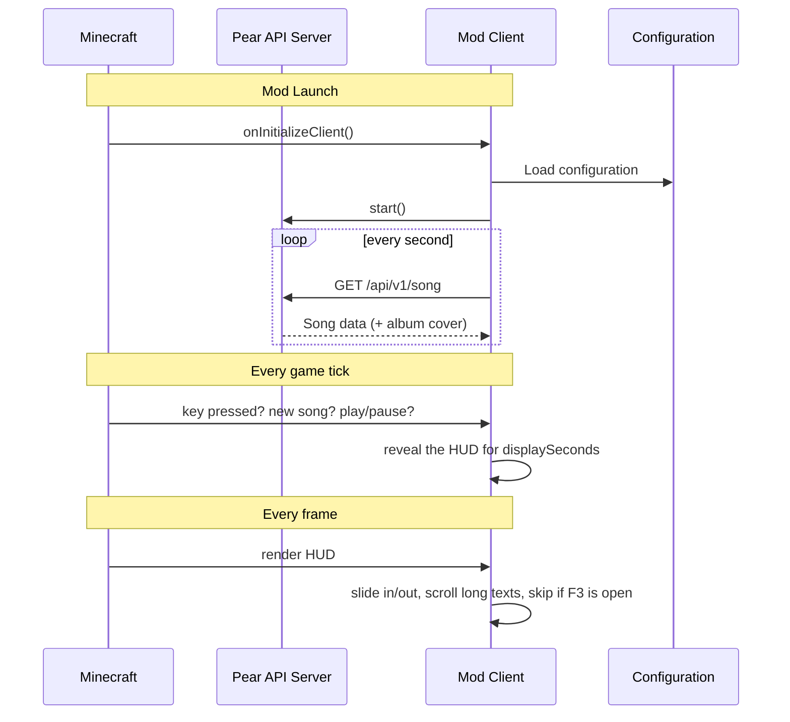

# Pear HUD ⭐

Displays the current music track from **Pear Desktop** in Minecraft's HUD. An elegant small red interface with album art, song title, artist, playback time, and progress bar. It slides in when something happens (new song, play/pause, key press) and tucks itself away on the side of the screen the rest of the time.


---

## 📦 Mod Information

| Property       | Value                                |
|----------------|--------------------------------------|
| **Mod ID**     | `pearhud`                            |
| **Version**    | 1.0.0 (Minecraft 26.3)               |
| **Authors**    | JusteKal                             |
| **License**    | [MIT](LICENSE)                       |
| **Launch**     | Java 25+ with Fabric API             |

---

## 🎯 Features

- ✅ Current song title, artist and playback time
- ✅ Visual progress bar
- ✅ Dynamic album art (cover)
- ✅ **Scrolling text**: long titles and artists scroll instead of being cut with "..."
- ✅ **Auto-docking HUD**: slides off the left or right edge of the screen when idle
- ✅ **Smart reveal**: slides back in when the song changes, when playback is paused or resumed, or when you press a key
- ✅ **Configurable key** in *Options > Controls > Pear HUD* (default: `H`)
- ✅ **Hidden while the F3 debug screen is open**
- ✅ Connection status indicator (connecting, authorization, offline, no song)
- ✅ Fully configurable via `.minecraft/config/pearhud.json`

---

## 🚀 Installation

### 1️⃣ Prerequisites

- **Minecraft 26.3**
- **Fabric Loader >= 0.19.5**
- **Fabric API** (`0.161.0+26.3` or newer)
- **Java 25+**

### 2️⃣ Install Pear Desktop (API Server)

This mod requires Pear Desktop! Make sure to have:

1. Installed [Pear Desktop](https://pear-desktop.com/) (v3.12.0+)
2. Enabled the **API Server** plugin in Pear Desktop
   - Settings > Plugins > API Server > ✅ Enable
   - Default port: `26538` (HTTP, leave HTTPS disabled)

### 3️⃣ Authorize Access

Depending on the **Authorization strategy** of the API Server plugin:

- **None**: nothing to do, the mod reads the current song directly.
- **Authorize at first request**: launch Minecraft with Pear Desktop open. A Pear popup asks you to authorize *"minecraft-pear-hud"*. Click **Authorize** and the token is stored automatically in `pearhud.json`.

### 4️⃣ Install the mod

Place the jar in your `mods/` folder (`.minecraft/mods/`) next to Fabric API.

---

## 🎮 Controls & Behavior

Options > Controls > **Pear HUD** > *Show / hide music HUD* (default key: `H`, rebindable like any other key).

By default (`autoHide: true`) the HUD stays tucked away on the side of the screen and slides out when:

| Trigger | Result |
|---------|--------|
| A new song starts | HUD slides out for `displaySeconds` seconds |
| Playback is paused or resumed | HUD slides out for `displaySeconds` seconds |
| You press the key | HUD slides out for `displaySeconds` seconds, press again to put it away immediately |

Other behaviors:

- With `autoHide: false` the HUD is always visible and the key toggles it on and off.
- The HUD is hidden while the **F3** debug screen is open (`hideInDebug`).
- Titles and artists that are too long scroll horizontally: a short pause at the start, scrolling to the end, a pause, then back to the start. The scrolling restarts on every new song.
- Pause and play changes are picked up within about a second, since the mod polls Pear once per second.

---

## ⚙️ Configuration

The configuration file is located at `.minecraft/config/pearhud.json`. It is created on first launch, and new options are added automatically when you update the mod. Close Minecraft before editing it by hand.

```json
{
  "enabled": true,
  "host": "127.0.0.1",
  "port": 26538,
  "authId": "minecraft-pear-hud",
  "accessToken": "",
  "x": 6,
  "y": 6,
  "width": 190,
  "autoHide": true,
  "displaySeconds": 5,
  "side": "LEFT",
  "hideInDebug": true,
  "scrollSpeed": 25
}
```

| Option | Default | Description |
|--------|---------|-------------|
| `enabled` | `true` | Enable or disable the mod |
| `host` | `127.0.0.1` | Pear Desktop address |
| `port` | `26538` | API Server port (HTTP) |
| `authId` | `minecraft-pear-hud` | Name shown in Pear's authorization popup |
| `accessToken` | `""` | Filled automatically after authorization |
| `x` | `6` | Margin from the chosen `side`, in pixels |
| `y` | `6` | Margin from the top of the screen, in pixels |
| `width` | `190` | Total width of the HUD |
| `autoHide` | `true` | `true`: tuck the HUD away when idle. `false`: always visible |
| `displaySeconds` | `5` | How long the HUD stays out after a trigger (1 to 60) |
| `side` | `LEFT` | `LEFT` or `RIGHT`: side of the screen the HUD docks to |
| `hideInDebug` | `true` | Hide the HUD while the F3 screen is open |
| `scrollSpeed` | `25` | Scrolling speed of long texts, in pixels per second |

### Display States

- **Connecting...** — Just after connecting to Pear Desktop
- **Authorize access in Pear** — Waiting for permissions
- **Access Denied (retry in 30s)** — Authorization refused, the mod retries later
- **Pear Unreachable (API Server?)** — Cannot contact Pear
- **No Song** — No track currently available

While the HUD is tucked away you won't see these states: press the key to bring it out.

---

## 🩺 Troubleshooting

| Problem | What to check |
|---------|---------------|
| "Pear Unreachable" | Pear Desktop is running, the **API Server** plugin is enabled, port is `26538`, HTTPS is off. Test with `Invoke-RestMethod http://127.0.0.1:26538/api/v1/song` in PowerShell |
| The HUD never shows up | Press the key (default `H`). If it is shown in red in *Controls*, another mod uses the same key: rebind one of them. Or set `autoHide` to `false` |
| The HUD still shows with F3 | Look for `Detection de l'ecran F3` in `logs/latest.log`: the F3 detection could not hook into this Minecraft version, the rest of the mod still works |
| No album cover | The cover is downloaded in the background, it can take a moment. Check `latest.log` for `Pochette illisible` |
| Game crashes at startup with `ClassNotFoundException` | An old jar of the mod is still in `mods/`. Keep only one `pearhud` jar |

---

## 🛠️ Build & Compilation

### Compile the mod

```bash
./gradlew build
```

> ⚠️ Requires JDK 25 or above (`java -version` must print 25.x)

The jar file will be generated in `build/libs/` (use `pearhud-1.0.0.jar`, not the `-sources` one).

### Copy the mod into Minecraft

1. Place the generated jar in your `mods/` folder (`.minecraft/mods/`)
2. Remove any older `pearhud` jar from that folder
3. Make sure Fabric API for 26.3 is installed

---

## 📁 Project Structure

```
mc_pearhud/
├── src/main/java/be/justekal/pearhud/
│   ├── PearHudClient.java    # Mod initialization, key binding, HUD rendering & animations
│   ├── PearApi.java          # HTTP client for the Pear API Server (song + cover)
│   └── PearConfig.java       # Configuration manager (.minecraft/config/)
├── src/main/resources/
│   ├── fabric.mod.json       # Fabric mod metadata
│   └── assets/pearhud/
│       ├── icon.png          # Mod icon
│       └── lang/             # Key binding translations (en_us, fr_fr)
├── build.gradle              # Gradle configuration
├── gradle.properties         # Versions & parameters
└── LICENSE
```

### Key Dependencies

- **Fabric API** : `0.161.0+26.3`
- **Minecraft** : `26.3`
- **Java** : `>= 25` (required for compilation and at runtime)

---

## 📊 Workflow



---

## 🗺️ Roadmap

- Config screen with Mod Menu (styles, themes, position)
- Keys to control playback (play/pause, next, previous)
- Synchronized lyrics, if the Pear API exposes them

---

## 🤝 Contributors

- **JusteKal** — Creator and main developer

---

## ⚖️ License

Distributed under the [MIT License](LICENSE). See [LICENSE](LICENSE) for full details.

---

## 📚 External Resources

- [Pear Desktop](https://pear-desktop.org/) — Music player with the API Server plugin
- [Fabric Modding Wiki](https://fabricmc.net/wiki/) — Official documentation
- [Fabric development page](https://fabricmc.net/develop) — Versions of Loader, Loom and Fabric API

---

**Licensed under MIT © 2026 JusteKal**
