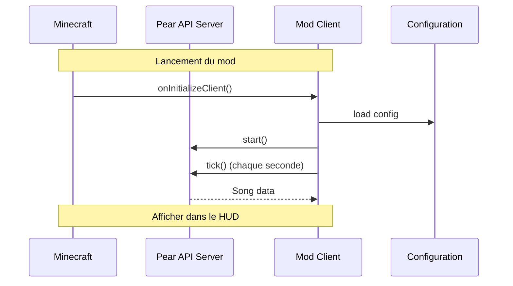

# Pear HUD ⭐

Affiche la musique en cours de lecture sur **Pear Desktop** dans le HUD de Minecraft. Une petite interface rouge élégante avec l'artwork de la pochette, le titre, l'artiste, le temps et une barre de progression.

  
*(Prévisualisation - à remplacer par votre propre capture)*

---

## 📦 Informations du mod

| Propriété        | Valeur                               |
|------------------|--------------------------------------|
| **Mod ID**       | `pearhud`                            |
| **Version**      | 1.0.0 (Minecraft 26.3)              |
| **Auteurs**      | JusteKal                             |
| **Licence**      | [MIT](LICENSE)                        |
| **Lancement**    | Java 25+ avec Fabric API             |

---

## 🎯 Fonctionnalités

- ✅ Affichage du titre, de l'artiste et du temps de lecture en cours
- ✅ Barre de progression visuelle
- ✅ Pochette album (cover art) dynamique
- ✅ Indicateur d'état (connexion, song, pause, offline)
- ✅ Configuration personnalisable dans `.minecraft/config/pearhud.json`

---

## 🚀 Installation

### 1️⃣ Prérequis

- **Minecraft 26.3** ou version compatible
- **Fabric Loader >= 0.19.5**
- **Java 25+** requis pour la compilation

### 2️⃣ Installer Pear Desktop (API Server)

Ce mod est incompatible sans Pear Desktop ! Assurez-vous d'avoir :

1. Installé [Pear Desktop](https://pear-desktop.org/) (v3.12.0+)
2. Activé le plugin **API Server** dans Pear Desktop  
   - Paramètres > Plugins > API Server > ✅ Activer  
   - Port par défaut : `26538` (HTTP)

### 3️⃣ Autoriser l'accès

1. Lancez Minecraft avec Pear Desktop
2. Une popup de Pear vous demandera d'autoriser *"minecraft-pear-hud"*
3. Cliquez sur **Autoriser** → le token d'authentification sera stocké automatiquement

---

## 🛠️ Build & Compilation

### Compiler le mod

```bash
./gradlew build
```

> ⚠️ Nécessite un JDK 25 ou supérieur

Le fichier jar sera généré dans : `build/libs/`

### Copier le mod dans Minecraft

1. Placez le jar produit dans votre dossier `mods/` (`.minecraft/mods/`)
2. Assurez-vous de lancer Minecraft avec le correct version des dépendances Fabric API

---

## ⚙️ Configuration

Le fichier de configuration se trouve à `.minecraft/config/pearhud.json`. Voici les options disponibles :

```json
{
  "enabled": true,                    // Activer/Désactiver le mod
  "host": "127.0.0.1",               // Serveur Pear Desktop
  "port": 26538,                     // Port API Server (HTTP)
  "authId": "minecraft-pear-hud",    // ID d'authentification
  "accessToken": "",                  // Token (rempli automatiquement au premier lancement)
  "x": 6,                            // Position X du HUD (pixels depuis la gauche)
  "y": 6,                            // Position Y du HUD (pixels depuis le haut)
  "width": 190                       // Largeur totale de l'interface
}
```

### États d'affichage

- **Connexion...** — Seconde après connexion à Pear Desktop
- **Autorise l'accès dans Pear** — Attente des permissions
- **Accès refusé (nouvel essai 30s)** — Le token a expiré, réessayer
- **Pear injoignable (API Server ?)** — Impossible de contacter Pear
- **Aucune musique** — Aucun titre disponible actuellement

---

## 📁 Structure du projet

```
mc_pearhud/
├── src/main/java/be/justekal/pearhud/
│   ├── PearHudClient.java    # Initialisation & HUD de Minecraft
│   ├── PearApi.java          # Client HTTP pour API Server Pear
│   └── PearConfig.java       # Gestion des config (.minecraft/config/)
├── src/main/resources/
│   └── fabric.mod.json       # Metadata du mod Fabric
├── build.gradle               # Configuration Gradle
├── gradle.properties         # Versions & paramètres
└── LICENSE
```

### Dépendances principales

- **Fabric API** : `0.161.0+26.3`
- **Minecraft** : `26.3`
- **Java** : `>= 25` (nécessaire pour compilation)

---

## 📊 Flux de travail



---

## 🤝 Contributeurs

- **JusteKal** — Créateur et développeur principal

---

## ⚖️ Licence

Distribué sous la [Licence MIT](LICENSE). Voir [LICENSE](LICENSE) pour les détails complets.

---

## 📚 Ressources externes

- [Pear Desktop](https://peardesktop.com) — Le serveur de musique
- [Fabric Modding Wiki](https://fabricmc.net/wiki/) — Documentation officielle
- [Minecraft 26.3 (Development)](https://fabricmc.net/develop) — Pré-release Minecraft

---

**Projet sous licence MIT © 2026 JusteKal**
